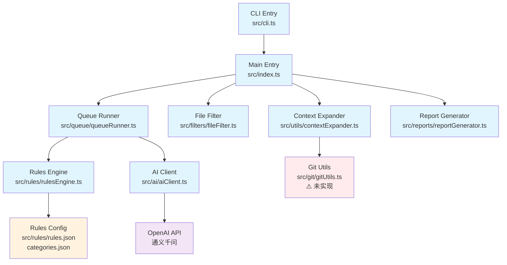
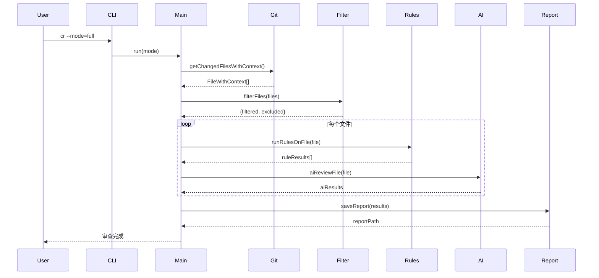

# AI-CR 架构设计文档

## 系统架构图



## 数据流图



## 模块职责矩阵

| 模块 | 职责 | 状态 | 复杂度 |
|------|------|------|--------|
| **CLI层** | | | |
| cli.ts | 命令行参数解析、选项处理 | ✅ 完整 | 低 |
| index.ts | 主流程编排、模式控制 | ✅ 完整 | 中 |
| **数据获取** | | | |
| contextExpander.ts | Git文件变更检测、内容读取 | ⚠️ 基础实现 | 中 |
| gitUtils.ts | Git操作封装 | ❌ 空实现 | 中 |
| **文件处理** | | | |
| fileFilter.ts | 文件类型过滤、路径匹配 | ✅ 完整 | 高 |
| queueRunner.ts | 串行队列处理 | ✅ 完整 | 低 |
| **审查引擎** | | | |
| rulesEngine.ts | 静态规则检查 | ⚠️ 硬编码实现 | 低 |
| aiClient.ts | AI审查接口、降级处理 | ✅ 完整 | 中 |
| **输出处理** | | | |
| reportGenerator.ts | Markdown报告生成 | ✅ 完整 | 中 |

## 技术债务分析

### 高优先级

1. **Git模块缺失** (`src/git/gitUtils.ts`)
   - 当前状态：仅有接口定义，无实现
   - 影响：依赖shell命令，存在兼容性风险
   - 修复成本：中等

2. **规则引擎硬编码** (`src/rules/rulesEngine.ts`)
   - 当前状态：规则逻辑写死在代码中
   - 影响：JSON配置文件未被使用，扩展性差
   - 修复成本：中等

### 中优先级

3. **错误处理不统一**
   - 当前状态：各模块错误处理方式不一致
   - 影响：调试困难，用户体验不一致
   - 修复成本：低

4. **测试覆盖缺失**
   - 当前状态：package.json中测试为占位
   - 影响：代码质量无法保证
   - 修复成本：高

### 低优先级

5. **性能优化空间**
   - 当前状态：串行处理，同步文件读取
   - 影响：大项目处理速度慢
   - 修复成本：中等

## 依赖关系图

```mermaid
graph LR
    %% 核心依赖
    Core[AI-CR Core] --> Commander[commander<br/>CLI框架]
    Core --> OpenAI[openai<br/>AI SDK]
    Core --> Inquirer[inquirer<br/>交互式CLI]
    Core --> DayJS[dayjs<br/>时间处理]
    Core --> DotEnv[dotenv<br/>环境变量]
    
    %% 开发依赖
    Dev[Development] --> TypeScript[typescript<br/>类型系统]
    Dev --> TSX[tsx<br/>TS执行器]
    Dev --> ESLint[eslint<br/>代码检查]
    Dev --> Prettier[prettier<br/>代码格式化]
    
    %% 运行时依赖
    Runtime[Runtime] --> NodeTypes[@types/node<br/>Node.js类型]
    
    %% 样式
    classDef prod fill:#e8f5e8
    classDef dev fill:#fff2cc
    classDef runtime fill:#f0f8ff
    
    class Commander,OpenAI,Inquirer,DayJS,DotEnv prod
    class TypeScript,TSX,ESLint,Prettier dev
    class NodeTypes runtime
```

## 架构问题总结

### 设计问题

1. **模块耦合度**：中等，各模块职责相对清晰
2. **扩展性**：受限于硬编码规则和固化的文件结构
3. **可测试性**：较差，缺少依赖注入和mock机制
4. **错误恢复**：基本具备，但不够统一

### 性能问题

1. **I/O密集**：大量同步文件读取操作
2. **API调用**：无并发控制和重试机制
3. **内存使用**：未考虑大文件处理的内存优化

### 安全问题

1. **命令注入**：使用execSync执行git命令存在潜在风险
2. **API密钥**：环境变量处理基本安全
3. **文件操作**：无路径遍历保护

## 改进建议

### 架构层面

1. **引入依赖注入**：提高可测试性和模块解耦
2. **实现真正的规则引擎**：支持JSON配置驱动
3. **统一错误处理**：建立统一的错误类型和处理机制

### 技术层面

1. **替换Git实现**：使用simple-git库替代shell命令
2. **添加并发控制**：支持文件并行处理
3. **完善测试体系**：单元测试、集成测试、E2E测试

### 工程层面

1. **CI/CD流程**：自动化测试、构建、发布
2. **文档完善**：API文档、贡献指南
3. **监控体系**：性能监控、错误追踪