# AI-CR 智能代码审查工具使用指南

## 🎯 工具介绍

AI-CR 是一款智能代码审查工具，基于AI技术，能够自动分析代码质量、发现潜在问题并提供改进建议。

### ✨ 核心特性

- **智能分析**：基于 AI 的深度代码分析，超越传统 ESLint 规则
- **多模式审查**：支持静态规则检查、AI 审查、完整审查三种模式
- **高性能处理**：支持并行处理和智能缓存，大幅提升审查速度
- **详细报告**：生成 Markdown 格式的详细审查报告
- **CI/CD 集成**：轻松集成到现有的开发流程中

## 🚀 快速开始

### 步骤 1：安装工具

#### 全局安装（推荐）

```bash
npm install -g @asthestarslept/ai-cr
```

#### 项目级安装

```bash
npm install --save-dev @asthestarslept/ai-cr
```

#### 使用 npx（无需安装）

```bash
npx @asthestarslept/ai-cr
```

### 步骤 2：获取 API Key

1. 访问 [阿里云百炼](https://bailian.console.aliyun.com/#/home)
2. 注册或登录阿里云账号
3. 开通 DashScope 服务
4. 创建 API Key
5. 复制 API Key，格式类似：`sk-xxx...`

### 步骤 3：初始化配置

首次使用需要进行初始化配置：

```bash
npx @asthestarslept/ai-cr --init
```

初始化过程会引导您完成以下配置：

1. **输入 API Key**：粘贴从阿里云获取的 API Key
2. **配置 API 地址**：使用默认地址或自定义
3. **选择模型**：推荐使用 `qwen3-coder-plus`
4. **配置用户信息**：输入您的真实姓名
5. **选择项目组**：从列表中选择您的项目组

### 步骤 4：开始使用

配置完成后，在项目根目录运行：

```bash
npx @asthestarslept/ai-cr
```

系统将自动分析您的代码并生成审查报告。

## 📋 详细配置说明

### 配置文件结构

AI-CR 使用两级配置：

1. **全局配置**：`~/.ai-cr/config.json`（用户级别）
2. **项目配置**：`.ai-cr.config.json`（项目级别）

### 全局配置示例

```json
{
  "apiKey": "sk-your-api-key-here",
  "baseURL": "https://dashscope.aliyuncs.com/compatible-mode/v1",
  "model": "qwen3-coder-plus",
  "userInfo": {
    "id": "user123",
    "name": "张三",
    "email": "zhangsan@example.com"
  },
  "backendApi": {
    "baseUrl": "http://localhost:36788"
  },
  "created": "2024-01-01T00:00:00.000Z",
  "updated": "2024-01-01T00:00:00.000Z"
}
```

### 项目配置示例

```json
{
  "project": {
    "projectGroupId": "group123",
    "projectGroupName": "前端团队",
    "projectName": "我的前端项目",
    "name": "my-frontend-project",
    "group": "前端团队",
    "mainBranch": "main",
    "developerName": "张三",
    "developerUserId": "user123"
  },
  "ai": {
    "temperature": 0.1,
    "maxTokens": 4000
  },
  "rules": {
    "enabled": ["quality", "security", "performance", "maintainability", "bestPractices"]
  },
  "created": "2024-01-01T00:00:00.000Z",
  "updated": "2024-01-01T00:00:00.000Z"
}
```

### 环境变量配置

您也可以通过环境变量进行配置：

```bash
# API 配置
export DASHSCOPE_API_KEY=sk-your-api-key-here
export AI_CR_API_BASE_URL=http://localhost:36788

# 性能配置
export AI_CR_ENABLE_CACHE=true
export AI_CR_MAX_WORKERS=4

# 上下文配置
export MAX_TOKENS_PER_FILE=4000
export CONTEXT_STRATEGY=auto
```

## 💻 使用方法

### 基础命令

```bash
# 基本使用（可使用以下任意命令）
npx @asthestarslept/ai-cr
# 或全局安装后直接使用
ai-code-review
ai-cr
cr

# 显示帮助信息
ai-cr --help

# 查看版本
ai-cr --version
```

### 命令行参数

```bash
# 启用并行处理（推荐）
ai-cr --parallel 4

# 禁用缓存
ai-cr --no-cache

# 显示详细日志
ai-cr --verbose

# 显示性能统计
ai-cr --stats

# 使用自定义配置文件
ai-cr --config ./custom-config.json

# 组合使用
ai-cr --mode full --parallel 8 --stats --verbose
```

## 📊 报告解读

AI-CR 会生成详细的 Markdown 格式报告，通常包含以下部分：

### 报告结构

```markdown
# 代码审查报告

## 📋 审查概览
- 审查文件数：15
- 发现问题数：8
- 严重程度分布：错误(2) 警告(4) 建议(2)

## 🔍 详细问题

### 🚨 错误级别
1. **安全问题**: src/utils/auth.js:45
   - 问题：使用了不安全的 localStorage 存储敏感信息
   - 建议：使用加密存储或改用安全的 cookie

### ⚠️ 警告级别
1. **性能问题**: src/components/List.jsx:12
   - 问题：在渲染函数中创建新对象，可能导致不必要的重渲染
   - 建议：将对象提取到组件外部或使用 useMemo

## 💡 改进建议
- 统一错误处理机制
- 添加 TypeScript 类型定义
- 优化组件渲染性能
```

### 问题等级说明

- **🚨 错误**：必须修复的严重问题（安全漏洞、功能错误）
- **⚠️ 警告**：建议修复的问题（性能问题、可维护性）
- **💡 建议**：优化建议（代码风格、最佳实践）

## 🔧 常见问题与解决方案

### Q1: API Key 验证失败

**问题**：提示 "API Key测试失败"

**解决方案**：

1. 确认 API Key 格式正确（以 `sk-` 开头）
2. 检查阿里云账户余额和服务状态
3. 验证网络连接和防火墙设置

```bash
# 重新初始化配置
npx @asthestarslept/ai-cr --init

# 检查 API 连接
curl -H "Authorization: Bearer YOUR_API_KEY" \
     https://dashscope.aliyuncs.com/compatible-mode/v1/models
```

### Q2: 配置丢失或损坏

**问题**：配置文件不存在或格式错误

**解决方案**：

```bash
# 重置全局配置
rm -rf ~/.ai-cr/config.json
npx @asthestarslept/ai-cr --init-global

# 重置项目配置
rm .ai-cr.config.json
npx @asthestarslept/ai-cr --init-project

# 完整重新初始化
npx @asthestarslept/ai-cr --init
```

## 🏆 最佳实践

### 团队协作流程

#### 1. Code Review 流程

```mermaid
graph LR
    A[开发完成] --> B[本地检查]
    B --> C{是否通过?}
    C -->|否| D[修复问题]
    D --> B
    C -->|是| E[提交代码]
    E --> F[CI 自动检查]
    F --> G{CI 检查通过?}
    G -->|否| H[查看报告]
    H --> D
    G -->|是| I[Code Review]
    I --> J[合并代码]
```



### 代码质量持续改进

#### 3. 团队培训

基于 AI-CR 发现的问题，定期组织团队培训：

- **安全编码**：针对发现的安全漏洞
- **性能优化**：解决常见的性能问题
- **代码规范**：统一团队编码风格
- **最佳实践**：分享 AI 建议的优秀实践

## 📞 支持与反馈

### 获取帮助

```bash
# 查看帮助信息
npx @asthestarslept/ai-cr --help

# 查看版本信息
npx @asthestarslept/ai-cr --version

# 检查配置状态
npx @asthestarslept/ai-cr --verbose
```

### 常用诊断命令

```bash
# 检查 API 连接
curl -H "Authorization: Bearer $DASHSCOPE_API_KEY" \
     https://dashscope.aliyuncs.com/compatible-mode/v1/models

# 查看配置文件
cat ~/.ai-cr/config.json
cat .ai-cr.config.json

# 清理缓存
rm -rf ~/.ai-cr/cache

# 重置所有配置
rm -rf ~/.ai-cr
rm .ai-cr.config.json
npx @asthestarslept/ai-cr --init
```

### 问题反馈

如果遇到问题，请提供以下信息：

1. **版本信息**：`npx @asthestarslept/ai-cr --version`
2. **错误日志**：`npx @asthestarslept/ai-cr --verbose`
3. **配置信息**：脱敏后的配置文件
4. **环境信息**：Node.js 版本、操作系统
5. **复现步骤**：详细的操作步骤

---

## 🎉 开始使用

现在您已经掌握了 AI-CR 的完整使用方法，可以开始在项目中使用了：

1. **安装工具**：`npm install -g @asthestarslept/ai-cr`
2. **初始化配置**：`npx @asthestarslept/ai-cr --init`
3. **开始审查**：`npx @asthestarslept/ai-cr`
4. **查看报告**：检查生成的 Markdown 报告
5. **持续改进**：根据建议优化代码质量
